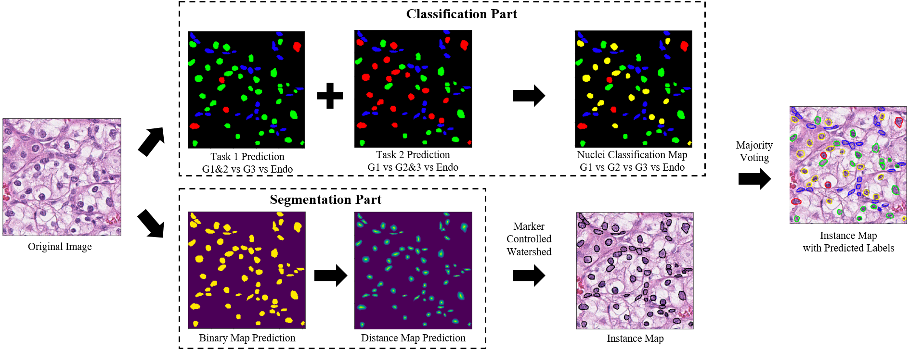
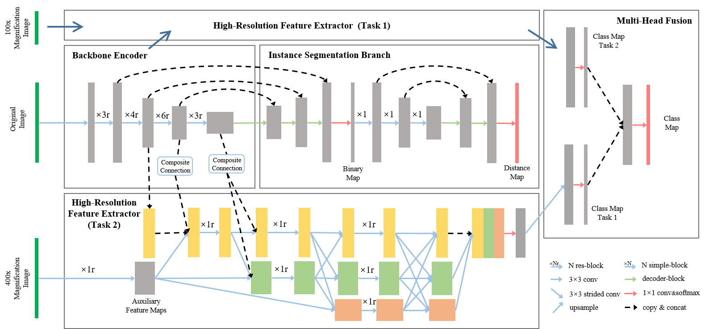

# Nuclei Grading of Clear Cell Renal Cell Carcinoma in Histopathological Image by Composite High-Resolution Network



A Composite High-Resolution Network for ccRCC nuclei grading. 

The network has two parts:
- Propose a segmentation network called W-Net that can separate the clustered nuclei.
- Recast the fine-grained classification of nuclei to two cross-category classification tasks, based on two high-resolution feature extractors (HRFEs) which are proposed for learning these two tasks. 

The two HRFEs share the same backbone encoder with W-Net by a composite connection so that meaningful features for the segmentation task can be inherited for the classification task. Finally, a head-fusion block is applied to generate the predicted label of each nucleus. 

[Link]() to MICCAI 2021 paper. 

## Set Up Environment

```
conda create --name hovernet python=3.6
conda activate hovernet
pip install -r requirements.txt
```

## Dataset

Download the ccRCC grading dataset as used in our paper from [this link](https://dataset.chenli.group/home/ccrcc-grading).

Ground truth files are in `.mat` format, refer to the website of this dataset for further information. 

## CHR-Net




## Citation

If any part of this code is used, please give appropriate citation to our paper.

## Getting Started

Install the required libraries before using this code. Please refer to `requirements.txt`

## Authors
- Zeyu Gao (betpotti@gmail.com)
- Jiangbo Shi (shijiangbo@stu.xjtu.edu.cn)
- Chen Li (cli@xjtu.edu.cn)

## Institute
[BioMedical Semantic Understanding Group](http://www.chenli.group/home), Xi'an Jiaotong University

## Workshop in BIBM
[AIPath](https://aipath.org/)

## License

This project is licensed under the MIT License - see the [LICENSE](LICENSE) file for details

## Acknowledgements
We have great thanks to the implementation of nuclei segmentation and classification framework [HoVerNet](https://github.com/vqdang/hover_net/tree/tensorflow-final).
This code is modified from the tensorflow version of HoVerNet.

The datasets used are in whole or part based upon data generated by [the TCGA Research Network](https://www.cancer.gov/tcga).
