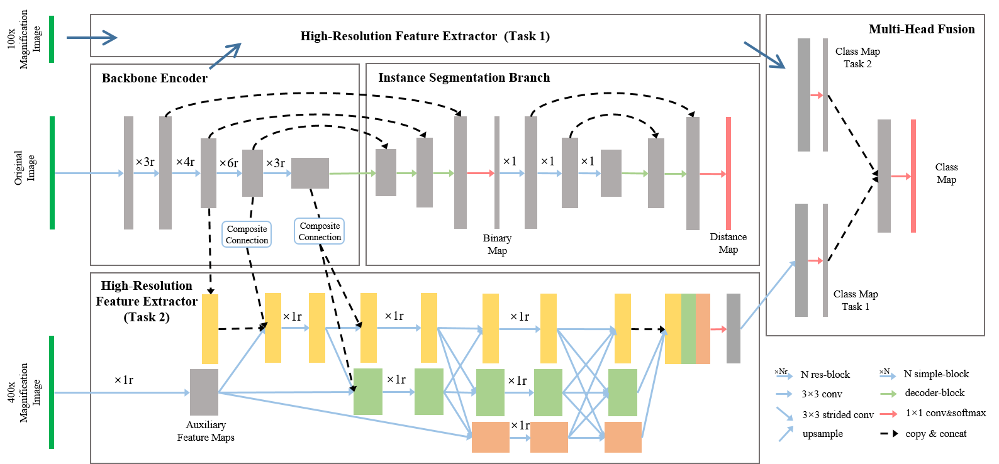

# Nuclei Grading of Clear Cell Renal Cell Carcinoma in Histopathological Image by Composite High-Resolution Network


A Composite High-Resolution Network for ccRCC nuclei grading. 

The network has two parts:
- Propose a segmentation network called W-Net that can separate the clustered nuclei.
- Recast the fine-grained classification of nuclei to two cross-category classification tasks, based on two high-resolution feature extractors (HRFEs) which are proposed for learning these two tasks. 

The two HRFEs share the same backbone encoder with W-Net by a composite connection so that meaningful features for the segmentation task can be inherited for the classification task. Finally, a head-fusion block is applied to generate the predicted label of each nucleus. 

[Link]() to MICCAI 2021 paper. 

## Set Up Environment

```
conda create --name hovernet python=3.6
conda activate hovernet
pip install -r requirements.txt
```

## Dataset

Download the CoNSeP dataset as used in our paper from [this link](https://warwick.ac.uk/fac/sci/dcs/research/tia/data/hovernet/). <br />
Download the Kumar, CPM-15, CPM-17 and TNBC datsets from [this link](https://drive.google.com/open?id=1l55cv3DuY-f7-JotDN7N5nbNnjbLWchK).  <br />

Ground truth files are in `.mat` format, refer to the README included with the datasets for further information. 

## Repository Structure

- `src/` contains executable files used to run the model. Further information on running the code can be found in the corresponding directory.
- `loader/`contains scripts for data loading and self implemented augmentation functions.
- `metrics/`contains evaluation code. 
- `misc/`contains util scripts. 
- `model/` contains scripts that define the architecture of the segmentation models. 
- `opt/` contains scripts that define the model hyperparameters. 
- `postproc/` contains post processing utils. 
- `config.py` is the configuration file. Paths need to be changed accordingly.
- `train.py` and `infer.py` are the training and inference scripts respectively.
- `process.py` is the post processing script for obtaining the final instances. 
- `extract_patches.py` is the patch extraction script. 

## CHR-Net




## Citation

If any part of this code is used, please give appropriate citation to our paper.

## Getting Started

Install the required libraries before using this code. Please refer to `requirements.txt`

## License

This project is licensed under the MIT License - see the [LICENSE](LICENSE) file for details

## Acknowledgements
We have great thanks to the implementation of nuclei segmentation and classification framework [HoVerNet](https://github.com/vqdang/hover_net/tree/tensorflow-final).
This code is modified from the tensorflow version of HoVerNet.

The datasets used are in whole or part based upon data generated by [the TCGA Research Network](https://www.cancer.gov/tcga).
